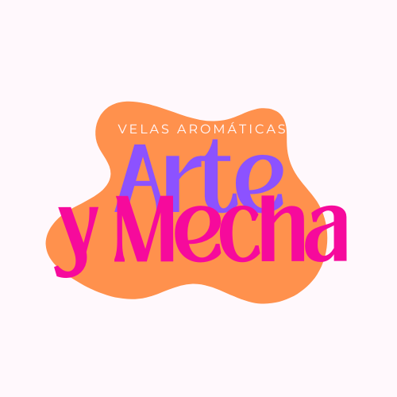

## _ECOMMERCE ARTE Y MECHA_

> Bienvenidos a mi primer ecommerce! Mi nombre es Adriana Kopp y este es mi proyecto final de ReactJS. Soy nueva en el mundo de la programación y aún me queda mucho por mejorar pero espero que les guste!

Puedes ver el demo de la app en:
`https://6480dceeb3dfa83302f55123--dapper-mandazi-c95ea3.netlify.app/`

## ¿Quienes somos?

- "Arte y Mecha" es un espacio donde encontrarán todo tipo de artículos relacionados a la aromaterapia. Nuestro objetivo es producir y comercializar velas aromáticas orientándonos a satisfacer las necesidades de nuestros clientes con innovación y creatividad, dando como resultado una amplia gama de productos. Queremos proveer al mercado velas decorativas con modelos innovadores. Con aromas únicos y de alta calidad, ofrecemos a nuestros clientes un precio justo para satisfacer sus deseos más exigentes.

[

## Para mejorar la experiencia de usuario utilicé:

✔✨ HTML✨  
✔✨CSS ✨
✔✨JavaScript ✨
✔✨ReactJs✨
✔✨nodeJs ✨
✔✨Firebase ✨
✔✨GitHub ✨
✔✨Vite ✨
✔✨Canva ✨

## Si deseas saber más sobre mis otros proyectos:

`https://github.com/Adriana-Kopp`
